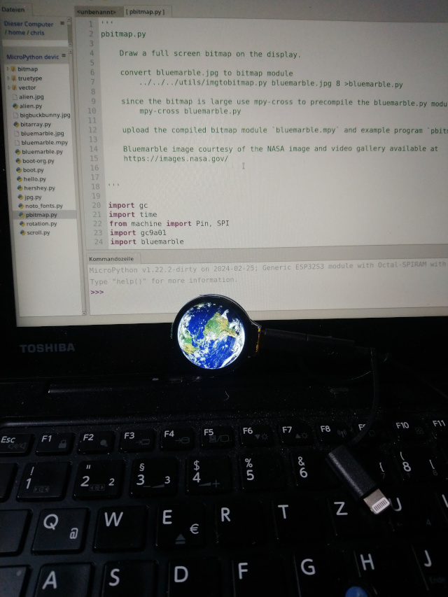

# Micropython on the Waveshare ESP32-S3-LCD-1.28

I recently bought a Waveshare ESP32-S3-LCD-1.28 to play a bit with
Micropython on that device. To do so, I needed to flash the device with a Micropython firmware.

The manufacturer of the device has a kind of a documentation published
here:

https://www.waveshare.com/wiki/ESP32-S3-LCD-1.28#MicroPython

That seemed to be quite "out of the box", but in reality it was
impossible to get the LCD screen up and running with the firmware there.
After loads of trial and error I found the reason for that in the
documentation for the device with touch screen support of the same
manufacturer:

https://www.waveshare.com/wiki/ESP32-S3-Touch-LCD-1.28

Here it reads "Please note that this firmware is for MicroPython
environment configuration, not for LCD lighting firmware". That pointed
me to this site:

https://github.com/russhughes/gc9a01_mpy/tree/main

Here a firmware with Micropython and support for the LCD screen included
is documented. A precompiled firmware for "WAVESHARE_RP2040_LCD_1.28" is
offered. But that one is NOT suitable for our device! The firmware comes
in uf2 file format and our device does not support uf2 flashing. After
another odyssee of trial and error I found that this firmware works:

https://github.com/russhughes/gc9a01_mpy/blob/main/firmware/ESP32_GENERIC_S3/firmware_SPIRAM_OCT_32MiB.bin

It is the generic s3 for 16 MB SPIRAM.

To flash it with Linux I used esptool. I had to download the newest
version from here (the one included in Debian Bookworm did not work):

https://github.com/espressif/esptool

I connected the device via USB to the PC. Longpressed the BOOTSEL button
and while pressed I short pressed RESET. Released RESET and after that
released BOOTSEL. Now I could flash the firmware with this command
("port" might be different on your PC):

esptool --port /dev/ttyACM0 --chip esp32s3 write_flash 0x00000
firmware_SPIRAM_OCT_16MiB.bin --flash_mode dio --erase

After the successfull flash I unplugged the device, plugged it back in
and was then able to connect to the device with the "Thonny" IDE, as
described in the manufacturers documentation.

The manufacturer offers some python test files, but there is error in
the documentation. It says:

"Upload the mpy file folder of the sample demo to the ESP32-S3-LCD-1.28"

Which is wrong. Do not upload the mpy folder to the root of the device,
but upload all the files and folders WITHIN the mpy folder to the root
of the device.

And after overcoming that hurdle I could finally run my first test, by
starting the test file pbitmap.py :-)
